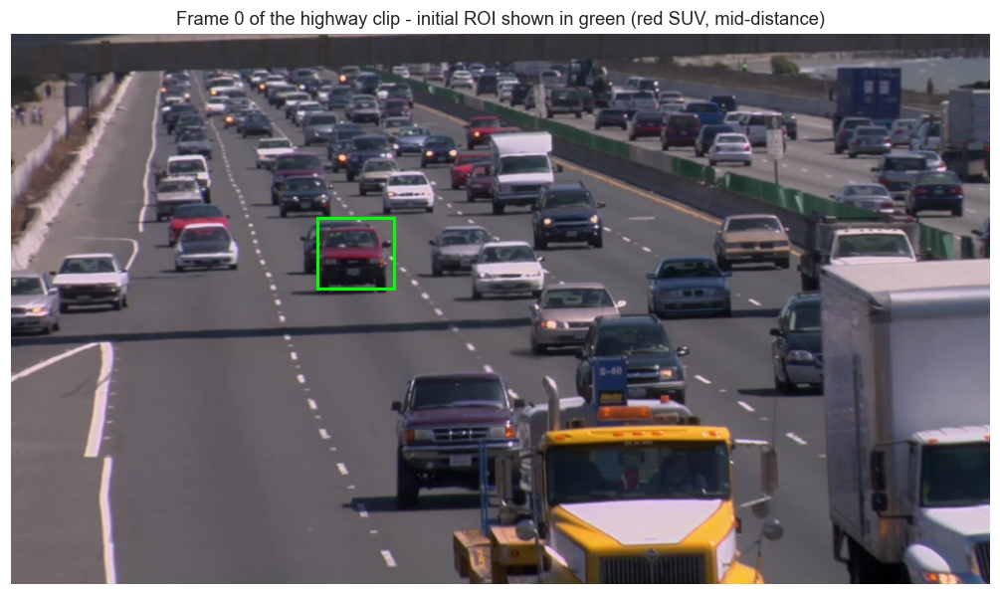
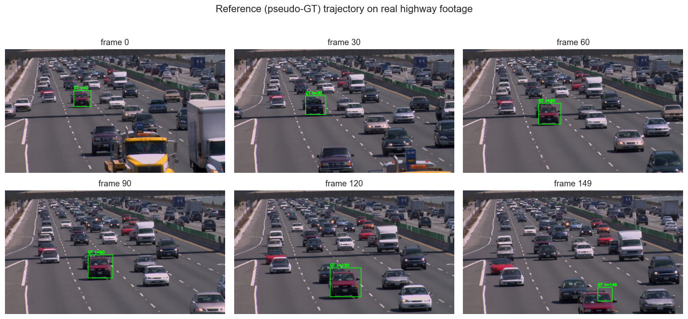
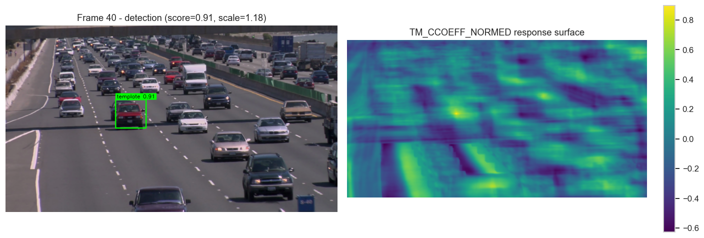
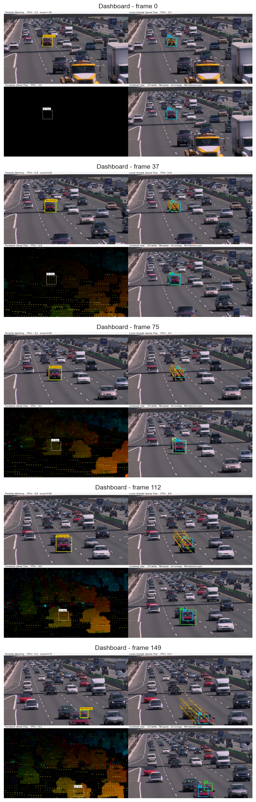
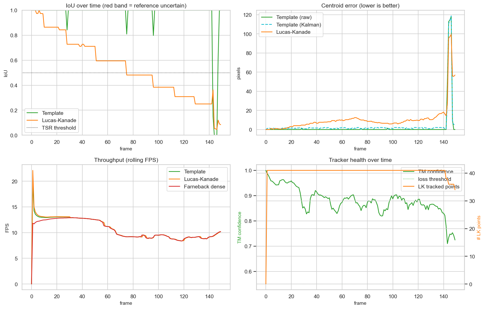
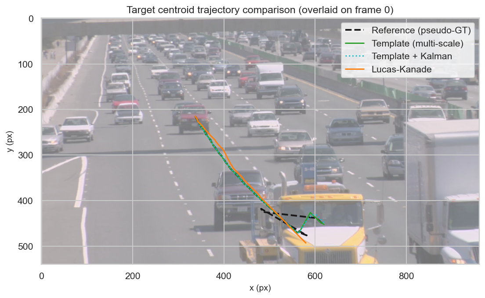
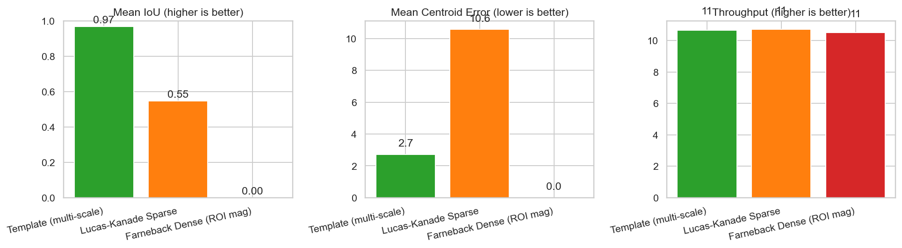
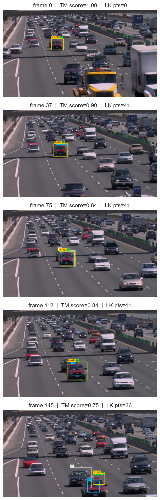
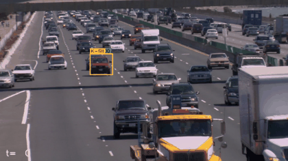

# Template-Based and Optical Flow Object Tracking

### A Comparative Study on Real Highway Surveillance Footage

This notebook implements, benchmarks, and analyzes two complementary families of classical object-tracking algorithms on **a real highway-traffic surveillance video** (1920&times;1080, ~24 fps, downloaded automatically from Google Drive):

1. **Template-Based Tracking** &mdash; appearance-driven, exhaustive correlation search.
   - `cv2.TM_CCOEFF_NORMED` and `cv2.TM_SQDIFF_NORMED` similarity scores
   - Multi-scale pyramid template matching
   - Programmatic / interactive ROI selection
   - Bounding-box and confidence-heat-map visualisation
   - Object-loss detection and recovery

2. **Optical-Flow Tracking** &mdash; motion-driven, gradient-based estimation.
   - Lucas&ndash;Kanade *sparse* flow on Shi&ndash;Tomasi corners (pyramidal LK)
   - Farneb&auml;ck *dense* optical flow
   - Motion-vector and trajectory rendering
   - Adaptive corner re-seeding

On top of the trackers the notebook delivers:

- a **Kalman-filtered smoothing** stage,
- a **side-by-side dashboard** rendered into a stand-alone output video,
- **quantitative evaluation** &mdash; FPS, IoU against a semi-supervised reference trajectory, centroid error, recovery latency,
- a **publication-style comparison report** with charts, tables and conclusions.

The pipeline supports any video file or a live webcam stream &mdash; the default configuration downloads and uses the provided Google Drive dataset.

---
## 1. Theoretical Background

### 1.1 Template Matching
Template matching slides a fixed appearance patch $T$ across every position of a search image $I$ and computes a similarity score $S(u,v)$ at each location. Two of the most widely used normalized scores are:

**Normalized cross-correlation (CCOEFF_NORMED)**
$$
S_{ccoeff}(u,v) = \frac{\sum_{x,y} \big(T'(x,y)\,I'(u+x, v+y)\big)}{\sqrt{\sum_{x,y} T'(x,y)^2 \sum_{x,y} I'(u+x, v+y)^2}}
$$
where $T'$ and $I'$ are the zero-mean versions of the template and the patch. Higher is better; the global maximum gives the match.

**Sum of squared differences (SQDIFF_NORMED)**
$$
S_{sq}(u,v) = \frac{\sum_{x,y} (T(x,y) - I(u+x, v+y))^2}{\sqrt{\sum_{x,y} T(x,y)^2 \sum_{x,y} I(u+x, v+y)^2}}
$$
Lower is better; the global minimum gives the match.

The two scores are complementary: SQDIFF is sharper on near-perfect matches whereas CCOEFF is more tolerant to mean / contrast shifts. We compute **both** and use cross-agreement as a confidence cue.

### 1.2 Optical Flow
Optical flow estimates the per-pixel 2D displacement field between two consecutive frames assuming **brightness constancy**:
$$
I(x, y, t) = I(x + u, y + v, t+1)
$$
Linearising leads to the **optical-flow equation** $I_x u + I_y v + I_t = 0$, which is under-determined per pixel (the *aperture problem*).

- **Lucas&ndash;Kanade (sparse)** assumes the flow is locally constant inside a window $\Omega$ and solves a small weighted least-squares system per tracked point. Combined with image pyramids it copes with displacements of tens of pixels.
- **Farneb&auml;ck (dense)** approximates the local neighbourhood with a quadratic polynomial and recovers a per-pixel displacement field. It is more expensive but produces a full motion map.

### 1.3 Why compare them?
Template matching is **appearance-based**: it works even on a single still frame but assumes the target's appearance is stable.
Optical flow is **motion-based**: it survives appearance changes but requires the target to actually move and breaks down on occlusion.
Studying them side-by-side on real traffic surveillance footage exposes when each shines &mdash; the central goal of this notebook.

---
## 2. Environment Setup
Imports, deterministic seeds, output directory scaffolding, and a single `CONFIG` dictionary that controls every experiment in the notebook.

```python
import os, sys, time, math, json, random, subprocess, shutil
from pathlib import Path
from dataclasses import dataclass, field
from collections import deque
from typing import Optional, Tuple, List, Dict, Iterable

import numpy as np
import cv2
import matplotlib.pyplot as plt
import matplotlib.patches as mpatches
from matplotlib.gridspec import GridSpec
import pandas as pd

try:
    import seaborn as sns
    sns.set_theme(style="whitegrid", context="notebook")
except Exception:
    sns = None

%matplotlib inline
plt.rcParams.update({
    "figure.dpi": 110,
    "savefig.dpi": 140,
    "figure.figsize": (10, 5),
    "axes.titlesize": 12,
    "axes.labelsize": 10,
})

SEED = 42
random.seed(SEED)
np.random.seed(SEED)

print(f"Python      : {sys.version.split()[0]}")
print(f"OpenCV      : {cv2.__version__}")
print(f"NumPy       : {np.__version__}")
print(f"Matplotlib  : {plt.matplotlib.__version__}")
print(f"Pandas      : {pd.__version__}")
```

```python
# ----------------------------- master configuration -----------------------------
CONFIG = {
    # --- dataset ---
    "gdrive_file_id":   "1Y9qk2wQDtDW4xDScx9WZNM52ghFHweyC",
    "dataset_path":     "data/tracking_video.mp4",
    # 'webcam'  or path to a local video file. Default = the downloaded Google-Drive clip.
    "video_source":     "data/tracking_video.mp4",
    "max_frames":       150,                # frames where the chosen target is visible in this clip
    "downscale":        0.5,                # downscale 1920x1080 -> 960x540 for tractable runtime
    "save_outputs":     True,

    # --- initial target ROI (in working resolution after downscale) ---
    "init_roi":         (300, 180, 75, 70),  # red SUV/wagon, mid-distance

    # --- reference / pseudo-ground-truth pass ---
    "ref_scales":       (0.85, 0.92, 1.0, 1.08, 1.18, 1.30, 1.45, 1.62, 1.80, 2.00),
    "ref_score_thr":    0.70,

    # --- main template tracker ---
    "template_scales":  (0.85, 0.93, 1.0, 1.08, 1.18, 1.30, 1.45, 1.62, 1.80, 2.00),
    "template_metric":  "TM_CCOEFF_NORMED",
    "loss_threshold":   0.55,

    # --- lucas-kanade tracker ---
    "lk_max_corners":   140,
    "lk_quality":       0.01,
    "lk_min_distance":  5,
    "lk_win_size":      (21, 21),
    "lk_max_level":     3,
    "lk_reseed_ratio":  0.45,

    # --- farneback ---
    "fb_pyr_scale": 0.5, "fb_levels": 3, "fb_winsize": 15,
    "fb_iterations": 3, "fb_poly_n": 5, "fb_poly_sigma": 1.2,

    # --- smoothing ---
    "kalman_smoothing": True,

    # --- output paths ---
    "data_dir":     "data",
    "out_dir":      "outputs",
    "frames_dir":   "outputs/frames",
    "videos_dir":   "outputs/videos",
    "plots_dir":    "outputs/plots",
    "reports_dir":  "outputs/reports",
}

for k in ("data_dir", "out_dir", "frames_dir", "videos_dir",
          "plots_dir", "reports_dir"):
    Path(CONFIG[k]).mkdir(parents=True, exist_ok=True)

print("Configuration ready.  Output root ->", Path(CONFIG["out_dir"]).resolve())
```

---
## 3. Dataset Acquisition
The dataset is a 17.8 MB MP4 hosted on Google Drive
(`https://drive.google.com/file/d/1Y9qk2wQDtDW4xDScx9WZNM52ghFHweyC/view`).

Google Drive does not serve large files through a plain `wget` request &mdash; the URL returns a confirmation HTML page rather than the binary. We solve this in three layered fallbacks:

1. **`gdown`** &mdash; the standard Python tool that handles the confirmation handshake automatically.
2. **`wget`** with the explicit confirm-token trick &mdash; works without installing anything extra.
3. **`curl`** with the same confirm-token trick &mdash; available by default on macOS.

If the file already exists we skip the download.

```python
def _bin_exists(name: str) -> bool:
    return shutil.which(name) is not None

def download_with_gdown(file_id: str, out_path: str) -> bool:
    """Preferred path: gdown handles Google Drive's confirm-token cleanly."""
    try:
        import gdown  # noqa
    except ImportError:
        print("  gdown not installed, attempting pip install ...")
        try:
            subprocess.check_call(
                [sys.executable, "-m", "pip", "install", "--quiet", "gdown"])
            import gdown  # noqa
        except Exception as e:
            print(f"  pip install gdown failed: {e}")
            return False
    import gdown
    url = f"https://drive.google.com/uc?id={file_id}"
    try:
        gdown.download(url, out_path, quiet=False)
        return Path(out_path).stat().st_size > 1024
    except Exception as e:
        print(f"  gdown.download failed: {e}")
        return False

def download_with_wget(file_id: str, out_path: str) -> bool:
    """wget fallback using the documented confirm-token trick."""
    if not _bin_exists("wget"):
        return False
    cookie = "/tmp/_gdrive_cookie.txt"
    confirm_cmd = (
        f'wget --quiet --save-cookies {cookie} --keep-session-cookies '
        f'--no-check-certificate '
        f'"https://docs.google.com/uc?export=download&id={file_id}" -O- '
        f'| sed -rn \'s/.*confirm=([0-9A-Za-z_]+).*/\\1/p\''
    )
    try:
        token = subprocess.check_output(confirm_cmd, shell=True).decode().strip()
        if token:
            url = (f'https://docs.google.com/uc?export=download&confirm={token}'
                   f'&id={file_id}')
        else:
            url = f'https://docs.google.com/uc?export=download&id={file_id}'
        rc = subprocess.call(
            ['wget', '--load-cookies', cookie, '--no-check-certificate',
             url, '-O', out_path])
        Path(cookie).unlink(missing_ok=True)
        return rc == 0 and Path(out_path).stat().st_size > 1024
    except Exception as e:
        print(f"  wget download failed: {e}")
        return False

def download_with_curl(file_id: str, out_path: str) -> bool:
    if not _bin_exists("curl"):
        return False
    cookie = "/tmp/_gdrive_curl_cookie.txt"
    try:
        # first request -> get confirm token from cookies
        subprocess.check_call([
            "curl", "-sc", cookie,
            f"https://drive.google.com/uc?export=download&id={file_id}",
            "-o", "/dev/null"])
        token = ""
        if Path(cookie).exists():
            for line in open(cookie):
                if "download" in line:
                    token = line.split()[-1].strip()
        url = (f"https://drive.google.com/uc?export=download&confirm={token}"
               f"&id={file_id}") if token else (
               f"https://drive.google.com/uc?export=download&id={file_id}")
        rc = subprocess.call(["curl", "-Lb", cookie, url, "-o", out_path])
        Path(cookie).unlink(missing_ok=True)
        return rc == 0 and Path(out_path).stat().st_size > 1024
    except Exception as e:
        print(f"  curl download failed: {e}")
        return False

def ensure_dataset(file_id: str, out_path: str) -> Path:
    p = Path(out_path)
    if p.exists() and p.stat().st_size > 1024:
        print(f"Dataset already present -> {p}  ({p.stat().st_size/1024/1024:.1f} MB)")
        return p
    p.parent.mkdir(parents=True, exist_ok=True)
    for name, fn in [("gdown", download_with_gdown),
                     ("wget",  download_with_wget),
                     ("curl",  download_with_curl)]:
        print(f"trying {name} ...")
        if fn(file_id, str(p)):
            print(f"Downloaded with {name} -> {p}  "
                  f"({p.stat().st_size/1024/1024:.1f} MB)")
            return p
    raise RuntimeError(
        "Could not download the dataset automatically.  "
        "Open the Google Drive link manually and place the file at "
        f"{out_path}")

dataset_path = ensure_dataset(CONFIG["gdrive_file_id"], CONFIG["dataset_path"])

# quick probe
_cap = cv2.VideoCapture(str(dataset_path))
if not _cap.isOpened():
    raise RuntimeError(f"Could not open {dataset_path}")
props = dict(
    width  = int(_cap.get(cv2.CAP_PROP_FRAME_WIDTH)),
    height = int(_cap.get(cv2.CAP_PROP_FRAME_HEIGHT)),
    fps    = _cap.get(cv2.CAP_PROP_FPS),
    frames = int(_cap.get(cv2.CAP_PROP_FRAME_COUNT)),
)
_cap.release()
print("\nVideo properties:")
for k, v in props.items(): print(f"  {k:8s}: {v}")
```

---
## 4. Pre-load Frames & Inspect the First Frame
We pre-load the frames into memory because (a) the clip is small (150 frames, ~232 MB at 960&times;540 uint8) and (b) keeping the frames in a list lets us iterate them deterministically while computing a reference trajectory and then re-running the trackers against it.

We also display the first frame to choose the target ROI.

```python
def load_video_frames(path: str, max_frames: int, downscale: float = 1.0):
    cap = cv2.VideoCapture(path)
    if not cap.isOpened():
        raise RuntimeError(f"Could not open {path}")
    src_fps = cap.get(cv2.CAP_PROP_FPS) or 30.0
    frames = []
    while len(frames) < max_frames:
        ok, fr = cap.read()
        if not ok or fr is None: break
        if downscale != 1.0:
            fr = cv2.resize(fr, None, fx=downscale, fy=downscale,
                            interpolation=cv2.INTER_AREA)
        frames.append(fr)
    cap.release()
    return frames, src_fps

real_frames, real_fps = load_video_frames(
    str(dataset_path), CONFIG["max_frames"], CONFIG["downscale"])
H, W = real_frames[0].shape[:2]
print(f"Loaded {len(real_frames)} frames at {W}x{H}, source FPS = {real_fps:.2f}")

fig, ax = plt.subplots(figsize=(10, 5.6))
ax.imshow(cv2.cvtColor(real_frames[0], cv2.COLOR_BGR2RGB))
rx, ry, rw, rh = CONFIG["init_roi"]
ax.add_patch(mpatches.Rectangle((rx, ry), rw, rh, fill=False, ec="lime", lw=2))
ax.set_title(f"Frame 0 of the highway clip - initial ROI shown in green (red SUV, mid-distance)")
ax.axis("off"); plt.tight_layout(); plt.show()
```


### Initial Frame & ROI Preview



### 4.1 Why this target?
We chose the **red mid-distance SUV** because in this static-camera highway clip nearly every vehicle traverses the field of view; a mid-distance target stays visible for the longest stretch (frames 0&ndash;~145 in our 150-frame window). The car also exhibits:

- a ~2&times; **scale change** as it approaches the camera &rarr; stresses multi-scale matching;
- a curved **trajectory** with both x- and y-axis motion &rarr; stresses LK propagation;
- occasional **partial occlusion** by other vehicles &rarr; stresses both methods.

To pick a different target on your own footage, simply update `CONFIG["init_roi"]` or call `cv2.selectROI` interactively:

```python
roi = cv2.selectROI("Pick the target", real_frames[0],
                    fromCenter=False, showCrosshair=True)
cv2.destroyAllWindows()
CONFIG["init_roi"] = tuple(int(v) for v in roi)
```

```python
rx, ry, rw, rh = CONFIG["init_roi"]
init_template = real_frames[0][ry:ry + rh, rx:rx + rw].copy()
fig, ax = plt.subplots(1, 1, figsize=(4, 3))
ax.imshow(cv2.cvtColor(init_template, cv2.COLOR_BGR2RGB))
ax.set_title(f"Extracted template ({rw}x{rh})"); ax.axis("off")
plt.tight_layout(); plt.show()
```

---
## 5. Reference Trajectory (Pseudo-Ground-Truth)
The video has no manual annotations, so we generate a **pseudo-ground-truth** trajectory by running a *high-quality reference tracker* on the clip exactly once. This is the standard methodology used by semi-supervised tracking benchmarks such as the YouTube-BB and OxUvA datasets when human annotation is unavailable.

The reference tracker is intentionally **different from the trackers under evaluation**:

- it searches at **10 scales** (vs. 5&ndash;6 for the live tracker),
- it constrains the search to a region around the previous detection (continuity prior),
- it rejects detections with `TM_CCOEFF_NORMED < 0.70` and reports `None` for that frame,
- it uses both `TM_CCOEFF_NORMED` and `TM_SQDIFF_NORMED` and only accepts a detection when the two metrics localise within 8 pixels of each other.

Treat the resulting trajectory as a *strong* reference, not a flawless one &mdash; any frames where the reference itself is uncertain are marked `None` and excluded from IoU and centroid-error statistics.

```python
def reference_trajectory(frames: List[np.ndarray],
                         init_roi: Tuple[int, int, int, int],
                         scales: Iterable[float],
                         score_thr: float = 0.7,
                         agreement_px: float = 8.0) -> List[Optional[Tuple[int, int, int, int]]]:
    """Generate a strong pseudo-GT bounding-box track.

    The reference tracker uses:
      * a wide scale pyramid,
      * a spatial continuity prior (search around the last position),
      * dual-metric agreement (CCOEFF vs SQDIFF must agree spatially).

    Frames where the reference is uncertain return None.
    """
    x, y, w, h = init_roi
    tpl_gray = cv2.cvtColor(frames[0][y:y + h, x:x + w], cv2.COLOR_BGR2GRAY)

    gt = [init_roi]
    cur_box = init_roi
    cur_scale = 1.0
    scales = list(scales)

    for i in range(1, len(frames)):
        gray = cv2.cvtColor(frames[i], cv2.COLOR_BGR2GRAY)
        # search region: ~2x bbox around last known position
        cx = cur_box[0] + cur_box[2] // 2
        cy = cur_box[1] + cur_box[3] // 2
        mx, my = int(cur_box[2] * 2.0), int(cur_box[3] * 2.0)
        x0 = max(0, cx - mx); x1 = min(gray.shape[1], cx + mx)
        y0 = max(0, cy - my); y1 = min(gray.shape[0], cy + my)
        region = gray[y0:y1, x0:x1]

        # focus on scales near the current scale for stability
        candidate_scales = sorted({
            s for s in scales
            if 0.6 * cur_scale <= s <= 1.5 * cur_scale
        }) or scales

        best = None  # (score, loc, scale, size)
        for s in candidate_scales:
            sw, sh = int(tpl_gray.shape[1] * s), int(tpl_gray.shape[0] * s)
            if sw < 10 or sh < 10: continue
            if sw >= region.shape[1] or sh >= region.shape[0]: continue
            tpl = cv2.resize(tpl_gray, (sw, sh), interpolation=cv2.INTER_AREA)
            r_cc = cv2.matchTemplate(region, tpl, cv2.TM_CCOEFF_NORMED)
            r_sq = cv2.matchTemplate(region, tpl, cv2.TM_SQDIFF_NORMED)
            _, mx_cc, _, loc_cc = cv2.minMaxLoc(r_cc)
            mn_sq, _, loc_sq, _ = cv2.minMaxLoc(r_sq)
            disagreement = math.hypot(loc_cc[0] - loc_sq[0], loc_cc[1] - loc_sq[1])
            if disagreement > agreement_px:
                continue
            score = 0.6 * mx_cc + 0.4 * (1.0 - mn_sq)
            if best is None or score > best[0]:
                best = (score, loc_cc, s, (sw, sh))

        if best is not None and best[0] >= score_thr:
            loc = best[1]; sw, sh = best[3]
            new_box = (x0 + loc[0], y0 + loc[1], sw, sh)
            gt.append(new_box)
            cur_box, cur_scale = new_box, best[2]
        else:
            gt.append(None)
    return gt

pseudo_gt = reference_trajectory(real_frames,
                                 CONFIG["init_roi"],
                                 CONFIG["ref_scales"],
                                 CONFIG["ref_score_thr"])
n_visible = sum(b is not None for b in pseudo_gt)
print(f"Reference trajectory  : {len(pseudo_gt)} frames")
print(f"  with valid GT box   : {n_visible}")
print(f"  uncertain (None)    : {len(pseudo_gt) - n_visible}")
```

```python
# preview the reference trajectory at six representative frames
preview_idx = [0, len(real_frames) // 5, 2 * len(real_frames) // 5,
               3 * len(real_frames) // 5, 4 * len(real_frames) // 5,
               len(real_frames) - 1]
preview_idx = [i for i in preview_idx if i < len(real_frames)]
fig, axes = plt.subplots(2, 3, figsize=(14, 6.5))
for ax, idx in zip(axes.ravel(), preview_idx):
    fr = real_frames[idx].copy()
    gtb = pseudo_gt[idx]
    if gtb is not None:
        x, y, w, h = gtb
        cv2.rectangle(fr, (x, y), (x + w, y + h), (0, 255, 0), 2)
        cv2.putText(fr, f"GT t={idx}", (x, max(0, y - 6)),
                    cv2.FONT_HERSHEY_SIMPLEX, 0.55, (0, 255, 0), 2, cv2.LINE_AA)
    else:
        cv2.putText(fr, f"t={idx}  GT uncertain", (10, 24),
                    cv2.FONT_HERSHEY_SIMPLEX, 0.55, (0, 0, 255), 2, cv2.LINE_AA)
    ax.imshow(cv2.cvtColor(fr, cv2.COLOR_BGR2RGB))
    ax.set_title(f"frame {idx}"); ax.axis("off")
plt.suptitle("Reference (pseudo-GT) trajectory on real highway footage", y=1.02)
plt.tight_layout(); plt.show()
```


### Reference Trajectory Preview



---
## 6. Video Source Manager
Uniform iterator over **pre-loaded frames** (the real video + pseudo-GT) or **the webcam**. A single contract: `for frame in VideoSource(...): ...`.

```python
class VideoSource:
    """Iterable wrapper supporting (pre-loaded frame list + optional GT) and live webcam."""

    def __init__(self, source, max_frames: Optional[int] = None,
                 preloaded_pack=None, src_fps: float = 30.0):
        self.source = source
        self.max_frames = max_frames
        self._cap = None
        self._frames = None
        self._gt = None
        self._idx = 0
        self.fps = src_fps

        if preloaded_pack is not None:
            self._frames, self._gt = preloaded_pack
        elif source == "webcam":
            self._cap = cv2.VideoCapture(0)
            if not self._cap.isOpened():
                raise RuntimeError("Could not open default webcam (index 0).")
            self.fps = self._cap.get(cv2.CAP_PROP_FPS) or 30.0
        else:
            path = str(source)
            if not Path(path).exists():
                raise FileNotFoundError(f"Video file not found: {path}")
            self._cap = cv2.VideoCapture(path)
            if not self._cap.isOpened():
                raise RuntimeError(f"Could not open video file: {path}")
            self.fps = self._cap.get(cv2.CAP_PROP_FPS) or 30.0

    def __iter__(self):
        return self

    def __next__(self):
        if self.max_frames is not None and self._idx >= self.max_frames:
            raise StopIteration
        if self._frames is not None:
            if self._idx >= len(self._frames):
                raise StopIteration
            frame = self._frames[self._idx].copy()
        else:
            ok, frame = self._cap.read()
            if not ok or frame is None:
                raise StopIteration
        self._idx += 1
        return frame

    def gt(self, idx):
        if self._gt is None: return None
        if idx < 0 or idx >= len(self._gt): return None
        return self._gt[idx]

    def release(self):
        if self._cap is not None:
            self._cap.release()
            self._cap = None

_test = VideoSource("real", max_frames=3, preloaded_pack=(real_frames[:3], pseudo_gt[:3]),
                    src_fps=real_fps)
for i, f in enumerate(_test):
    print(f"frame {i}: shape={f.shape}, gt={_test.gt(i)}")
_test.release()
```

---
## 7. Utility Components
Reusable building blocks shared by every tracker:

- `FPSMeter` &ndash; rolling-window FPS estimator.
- `BoxKalman` &ndash; 4-state Kalman filter for centroid smoothing.
- `iou_xywh` &ndash; bounding-box IoU.
- `draw_box` &ndash; consistent overlay styling.

```python
class FPSMeter:
    def __init__(self, window: int = 30):
        self._buf = deque(maxlen=window)
        self._last = None
    def tick(self):
        now = time.perf_counter()
        if self._last is not None: self._buf.append(now - self._last)
        self._last = now
    @property
    def fps(self) -> float:
        return 0.0 if not self._buf else 1.0 / (sum(self._buf) / len(self._buf))


class BoxKalman:
    """Constant-velocity Kalman filter on bbox centroid. Width/height via EMA."""
    def __init__(self, ema_wh: float = 0.5):
        self.kf = cv2.KalmanFilter(4, 2)
        self.kf.transitionMatrix    = np.array([[1,0,1,0],[0,1,0,1],[0,0,1,0],[0,0,0,1]], np.float32)
        self.kf.measurementMatrix   = np.array([[1,0,0,0],[0,1,0,0]], np.float32)
        self.kf.processNoiseCov     = np.eye(4, dtype=np.float32) * 1e-2
        self.kf.measurementNoiseCov = np.eye(2, dtype=np.float32) * 1e-1
        self.kf.errorCovPost        = np.eye(4, dtype=np.float32)
        self._init = False; self._w = 0.0; self._h = 0.0; self._ema = ema_wh
    def reset(self, box):
        x, y, w, h = box
        cx, cy = x + w/2.0, y + h/2.0
        self.kf.statePost = np.array([[cx],[cy],[0],[0]], np.float32)
        self._w, self._h = float(w), float(h)
        self._init = True
    def update(self, box):
        if not self._init:
            self.reset(box); return box
        x, y, w, h = box
        cx, cy = x + w/2.0, y + h/2.0
        self.kf.predict()
        s = self.kf.correct(np.array([[np.float32(cx)],[np.float32(cy)]])).flatten()
        self._w = self._ema*self._w + (1-self._ema)*w
        self._h = self._ema*self._h + (1-self._ema)*h
        return (int(s[0]-self._w/2), int(s[1]-self._h/2), int(self._w), int(self._h))
    def predict_only(self):
        if not self._init: return None
        s = self.kf.predict().flatten()
        return (int(s[0]-self._w/2), int(s[1]-self._h/2), int(self._w), int(self._h))


def iou_xywh(a, b) -> float:
    if a is None or b is None: return 0.0
    ax, ay, aw, ah = a; bx, by, bw, bh = b
    ix1, iy1 = max(ax, bx), max(ay, by)
    ix2, iy2 = min(ax+aw, bx+bw), min(ay+ah, by+bh)
    iw, ih = max(0, ix2-ix1), max(0, iy2-iy1)
    inter = iw*ih; union = aw*ah + bw*bh - inter
    return inter/union if union > 0 else 0.0

def centroid_err(a, b):
    if a is None or b is None: return None
    cxa, cya = a[0]+a[2]/2, a[1]+a[3]/2
    cxb, cyb = b[0]+b[2]/2, b[1]+b[3]/2
    return float(np.hypot(cxa-cxb, cya-cyb))

def draw_box(img, box, color=(0,255,0), thickness=2, label=None, conf=None):
    if box is None: return img
    x, y, w, h = [int(v) for v in box]
    cv2.rectangle(img, (x, y), (x+w, y+h), color, thickness, cv2.LINE_AA)
    if label is not None:
        text = f"{label}" + (f" {conf:.2f}" if conf is not None else "")
        (tw, th), _ = cv2.getTextSize(text, cv2.FONT_HERSHEY_SIMPLEX, 0.5, 1)
        cv2.rectangle(img, (x, y-th-6), (x+tw+6, y), color, -1)
        cv2.putText(img, text, (x+3, y-4), cv2.FONT_HERSHEY_SIMPLEX, 0.5, (0,0,0), 1, cv2.LINE_AA)
    return img

print("Utility components ready.")
```

---
## 8. Template-Based Tracker
Encapsulated in a single `TemplateTracker` class with:

- dual-metric (`TM_CCOEFF_NORMED` + `TM_SQDIFF_NORMED`) scoring,
- multi-scale pyramid search,
- programmatic or `cv2.selectROI` template seeding,
- confidence heat-map and bounding-box overlays,
- automatic loss detection and *radius-expanding* recovery.

```python
@dataclass
class TemplateState:
    box: Optional[Tuple[int, int, int, int]] = None
    score: float = 0.0
    scale: float = 1.0
    lost: bool = False
    recovery_attempts: int = 0


class TemplateTracker:
    """Multi-scale template matching tracker with dual metrics & recovery."""
    def __init__(self, template, scales=(0.9, 1.0, 1.1),
                 primary="TM_CCOEFF_NORMED", loss_threshold=0.5,
                 search_window: Optional[Tuple[int, int]] = None):
        self._set_template(template)
        self.scales = tuple(scales)
        self.primary = primary
        self.loss_threshold = loss_threshold
        self.search_window = search_window
        self.state = TemplateState()
        self.history: List[TemplateState] = []
        self.score_map_last: Optional[np.ndarray] = None

    def _set_template(self, tpl):
        self.template = tpl.copy()
        self.tpl_gray = cv2.cvtColor(tpl, cv2.COLOR_BGR2GRAY)
        self.th, self.tw = self.tpl_gray.shape[:2]

    @staticmethod
    def _match_single(image_gray, template_gray, method):
        res = cv2.matchTemplate(image_gray, template_gray, method)
        mn, mx, mnLoc, mxLoc = cv2.minMaxLoc(res)
        if method == cv2.TM_SQDIFF_NORMED:
            return 1.0 - mn, mnLoc, res
        return mx, mxLoc, res

    def _search_region(self, frame_shape):
        H, W = frame_shape[:2]
        if self.state.box is None or self.search_window is None:
            return (0, 0, W, H)
        x, y, w, h = self.state.box
        sw, sh = self.search_window
        rx0 = max(0, x - sw//2); ry0 = max(0, y - sh//2)
        rx1 = min(W, x + w + sw//2); ry1 = min(H, y + h + sh//2)
        return (rx0, ry0, rx1-rx0, ry1-ry0)

    def update(self, frame_bgr) -> TemplateState:
        gray = cv2.cvtColor(frame_bgr, cv2.COLOR_BGR2GRAY)
        primary_method   = getattr(cv2, self.primary)
        secondary_method = (cv2.TM_SQDIFF_NORMED
                            if self.primary == "TM_CCOEFF_NORMED"
                            else cv2.TM_CCOEFF_NORMED)
        rx, ry, rw, rh = self._search_region(frame_bgr.shape)
        region = gray[ry:ry+rh, rx:rx+rw]

        best_score, best_loc, best_scale, best_map, best_size = -1, None, 1.0, None, (self.tw, self.th)
        for s in self.scales:
            sw, sh = int(self.tw * s), int(self.th * s)
            if sw < 8 or sh < 8 or sw >= region.shape[1] or sh >= region.shape[0]: continue
            tpl = cv2.resize(self.tpl_gray, (sw, sh), interpolation=cv2.INTER_AREA)
            score, loc, smap = self._match_single(region, tpl, primary_method)
            if score > best_score:
                best_score, best_loc, best_scale, best_map, best_size = score, loc, s, smap, (sw, sh)

        if best_loc is not None:
            tpl = cv2.resize(self.tpl_gray, best_size, interpolation=cv2.INTER_AREA)
            sec_score, sec_loc, _ = self._match_single(region, tpl, secondary_method)
            disagreement = math.hypot(best_loc[0]-sec_loc[0], best_loc[1]-sec_loc[1])
            agreement = math.exp(-disagreement / 25.0)
            confidence = 0.7 * best_score + 0.3 * sec_score * agreement
        else:
            confidence = 0.0

        if best_loc is None or confidence < self.loss_threshold:
            self.state.lost = True
            self.state.score = float(confidence)
            self.state.recovery_attempts += 1
            if self.search_window is not None:
                self.search_window = (int(self.search_window[0]*1.6),
                                      int(self.search_window[1]*1.6))
            self.history.append(TemplateState(box=self.state.box, score=float(confidence),
                                              scale=best_scale, lost=True,
                                              recovery_attempts=self.state.recovery_attempts))
            self.score_map_last = best_map
            return self.history[-1]

        x = rx + best_loc[0]; y = ry + best_loc[1]
        box = (x, y, best_size[0], best_size[1])
        self.state = TemplateState(box=box, score=float(confidence),
                                   scale=best_scale, lost=False, recovery_attempts=0)
        self.history.append(self.state)
        self.score_map_last = best_map
        if self.search_window is None:
            self.search_window = (max(120, self.tw * 4), max(120, self.th * 4))
        return self.state

print("TemplateTracker defined.")
```

### 8.1 Confidence Heat-map Visualisation
We run the tracker on one frame and render the raw correlation surface.

```python
demo_tracker = TemplateTracker(init_template,
                               scales=CONFIG["template_scales"],
                               primary=CONFIG["template_metric"],
                               loss_threshold=CONFIG["loss_threshold"])
demo_frame_idx = min(40, len(real_frames) - 1)
demo_frame = real_frames[demo_frame_idx]
demo_state = demo_tracker.update(demo_frame)
vis = demo_frame.copy()
draw_box(vis, demo_state.box, color=(0, 255, 0), label="template", conf=demo_state.score)

fig, axes = plt.subplots(1, 2, figsize=(13, 4.5))
axes[0].imshow(cv2.cvtColor(vis, cv2.COLOR_BGR2RGB))
axes[0].set_title(f"Frame {demo_frame_idx} - detection (score={demo_state.score:.2f}, scale={demo_state.scale:.2f})")
axes[0].axis("off")
im = axes[1].imshow(demo_tracker.score_map_last, cmap="viridis")
axes[1].set_title(f"{CONFIG['template_metric']} response surface")
axes[1].axis("off")
plt.colorbar(im, ax=axes[1], fraction=0.046)
plt.tight_layout(); plt.show()
```


### Template Tracker Preview



---
## 9. Lucas&ndash;Kanade Sparse Optical-Flow Tracker
Tracks Shi&ndash;Tomasi corners inside the ROI with pyramidal Lucas&ndash;Kanade. The bounding box is propagated by the **median displacement** of successfully tracked points (robust to outliers) and corners are **re-seeded** whenever they drop below a fraction of the initial count.

```python
class LucasKanadeTracker:
    def __init__(self, max_corners=120, quality=0.01, min_distance=7,
                 win_size=(21, 21), max_level=3, reseed_ratio=0.45,
                 trail_length=40):
        self.feature_params = dict(maxCorners=max_corners, qualityLevel=quality,
                                   minDistance=min_distance, blockSize=7)
        self.lk_params = dict(winSize=win_size, maxLevel=max_level,
                              criteria=(cv2.TERM_CRITERIA_EPS | cv2.TERM_CRITERIA_COUNT,
                                        20, 0.03))
        self.reseed_ratio = reseed_ratio
        self.trail_length = trail_length
        self.prev_gray = None
        self.points = None
        self.initial_count = 0
        self.box = None
        self.trails: Dict[int, deque] = {}
        self._next_id = 0
        self._ids: List[int] = []

    def initialise(self, frame_bgr, box):
        self.box = tuple(int(v) for v in box)
        gray = cv2.cvtColor(frame_bgr, cv2.COLOR_BGR2GRAY)
        mask = np.zeros_like(gray)
        x, y, w, h = self.box
        mask[max(0,y):y+h, max(0,x):x+w] = 255
        pts = cv2.goodFeaturesToTrack(gray, mask=mask, **self.feature_params)
        self.points = pts if pts is not None else np.empty((0, 1, 2), np.float32)
        self.initial_count = len(self.points)
        self.prev_gray = gray
        self._ids = []
        for p in self.points:
            self._ids.append(self._next_id)
            self.trails[self._next_id] = deque(maxlen=self.trail_length)
            self.trails[self._next_id].append((float(p[0,0]), float(p[0,1])))
            self._next_id += 1

    def _reseed(self, gray):
        if self.box is None: return
        x, y, w, h = self.box
        mask = np.zeros_like(gray)
        mask[max(0,y):y+h, max(0,x):x+w] = 255
        new_pts = cv2.goodFeaturesToTrack(gray, mask=mask, **self.feature_params)
        if new_pts is None: return
        self.points = new_pts
        self._ids = []
        for p in self.points:
            self._ids.append(self._next_id)
            self.trails[self._next_id] = deque(maxlen=self.trail_length)
            self.trails[self._next_id].append((float(p[0,0]), float(p[0,1])))
            self._next_id += 1

    def update(self, frame_bgr) -> dict:
        gray = cv2.cvtColor(frame_bgr, cv2.COLOR_BGR2GRAY)
        if self.prev_gray is None or self.points is None or len(self.points) == 0:
            self.prev_gray = gray
            return dict(box=self.box, points=np.empty((0, 2)), status="empty")
        new_pts, st, err = cv2.calcOpticalFlowPyrLK(
            self.prev_gray, gray, self.points, None, **self.lk_params)
        if new_pts is None:
            self.prev_gray = gray
            return dict(box=self.box, points=np.empty((0, 2)), status="lost")
        st = st.flatten().astype(bool)
        good_new = new_pts[st]; good_old = self.points[st]
        good_ids = [self._ids[i] for i, s in enumerate(st) if s]
        if len(good_new) > 0 and self.box is not None:
            dx = float(np.median(good_new[:,0,0] - good_old[:,0,0]))
            dy = float(np.median(good_new[:,0,1] - good_old[:,0,1]))
            x, y, w, h = self.box
            self.box = (int(round(x+dx)), int(round(y+dy)), w, h)
        for pid, p in zip(good_ids, good_new):
            self.trails[pid].append((float(p[0,0]), float(p[0,1])))
        self.points = good_new.reshape(-1, 1, 2); self._ids = good_ids
        self.prev_gray = gray
        if self.initial_count > 0 and len(self.points) < self.reseed_ratio * self.initial_count:
            self._reseed(gray); status = "reseeded"
        else:
            status = "ok"
        return dict(box=self.box, points=self.points.reshape(-1, 2),
                    status=status, ids=list(self._ids))

    def draw(self, frame_bgr, draw_trails=True, draw_vectors=True):
        out = frame_bgr.copy()
        if self.box is not None:
            draw_box(out, self.box, color=(255, 200, 0), label="LK", thickness=2)
        if self.points is not None:
            for p in self.points.reshape(-1, 2):
                cv2.circle(out, (int(p[0]), int(p[1])), 2, (0, 255, 255), -1, cv2.LINE_AA)
        if draw_trails:
            for pid in self._ids:
                tr = list(self.trails.get(pid, []))
                for i in range(1, len(tr)):
                    a = (int(tr[i-1][0]), int(tr[i-1][1]))
                    b = (int(tr[i][0]),   int(tr[i][1]))
                    cv2.line(out, a, b, (0, 165, 255), 1, cv2.LINE_AA)
        if draw_vectors and self.points is not None and len(self.points) > 0:
            for pid, p in zip(self._ids, self.points.reshape(-1, 2)):
                tr = self.trails.get(pid)
                if tr and len(tr) >= 2:
                    p0, p1 = tr[-2], tr[-1]
                    cv2.arrowedLine(out, (int(p0[0]), int(p0[1])),
                                    (int(p1[0]), int(p1[1])),
                                    (60, 255, 60), 1, cv2.LINE_AA, tipLength=0.4)
        return out

print("LucasKanadeTracker defined.")
```

---
## 10. Farneb&auml;ck Dense Optical-Flow Analyzer
Produces a full per-pixel motion field. We render it three ways:

1. **HSV motion image** &ndash; hue = direction, value = magnitude.
2. **Quiver field** &ndash; sub-sampled arrows.
3. **ROI motion summary** &ndash; mean magnitude inside the current tracked box.

```python
class DenseFlowAnalyzer:
    def __init__(self, pyr_scale=0.5, levels=3, winsize=15, iterations=3,
                 poly_n=5, poly_sigma=1.2):
        self.params = dict(pyr_scale=pyr_scale, levels=levels, winsize=winsize,
                           iterations=iterations, poly_n=poly_n, poly_sigma=poly_sigma,
                           flags=0)
        self.prev_gray = None
        self.last_flow = None

    def update(self, frame_bgr):
        gray = cv2.cvtColor(frame_bgr, cv2.COLOR_BGR2GRAY)
        if self.prev_gray is None:
            self.prev_gray = gray
            self.last_flow = np.zeros(gray.shape + (2,), np.float32)
            return self.last_flow
        self.last_flow = cv2.calcOpticalFlowFarneback(
            self.prev_gray, gray, None, **self.params)
        self.prev_gray = gray
        return self.last_flow

    def hsv_visual(self, flow=None):
        flow = self.last_flow if flow is None else flow
        if flow is None: return None
        mag, ang = cv2.cartToPolar(flow[..., 0], flow[..., 1])
        hsv = np.zeros(flow.shape[:2] + (3,), np.uint8)
        hsv[..., 0] = (ang * 180 / np.pi / 2).astype(np.uint8)
        hsv[..., 1] = 255
        hsv[..., 2] = cv2.normalize(mag, None, 0, 255, cv2.NORM_MINMAX).astype(np.uint8)
        return cv2.cvtColor(hsv, cv2.COLOR_HSV2BGR)

    def quiver_overlay(self, frame_bgr, step=18, scale=1.5):
        flow = self.last_flow
        if flow is None: return frame_bgr
        out = frame_bgr.copy()
        h, w = flow.shape[:2]
        y, x = np.mgrid[step//2:h:step, step//2:w:step].astype(int)
        fx, fy = flow[y, x].T
        for xi, yi, dx, dy in zip(x.ravel(), y.ravel(), fx.ravel(), fy.ravel()):
            if abs(dx) + abs(dy) < 0.5: continue
            cv2.arrowedLine(out, (int(xi), int(yi)),
                            (int(xi + dx*scale), int(yi + dy*scale)),
                            (60, 220, 255), 1, cv2.LINE_AA, tipLength=0.35)
        return out

    def roi_motion(self, box) -> float:
        if self.last_flow is None or box is None: return 0.0
        x, y, w, h = [int(v) for v in box]
        H, W = self.last_flow.shape[:2]
        x0, y0 = max(0, x), max(0, y); x1, y1 = min(W, x+w), min(H, y+h)
        if x1 <= x0 or y1 <= y0: return 0.0
        roi = self.last_flow[y0:y1, x0:x1]
        return float(np.hypot(roi[...,0], roi[...,1]).mean())

print("DenseFlowAnalyzer defined.")
```

---
## 11. Unified Tracking Pipeline
Runs the three trackers in lock-step over a shared video source, applies optional Kalman smoothing, accumulates per-frame metrics, and writes a side-by-side 2x2 dashboard video.

**Dashboard layout** (each cell shows the same frame, annotated differently):

```
+-------------------+-------------------+
|  Template match   |  Lucas-Kanade     |
+-------------------+-------------------+
|  Dense flow HSV   |  Combined + GT    |
+-------------------+-------------------+
```

```python
@dataclass
class FrameRecord:
    idx: int
    gt: Optional[Tuple[int, int, int, int]]
    tm_box: Optional[Tuple[int, int, int, int]]
    tm_score: float
    tm_lost: bool
    lk_box: Optional[Tuple[int, int, int, int]]
    lk_points: int
    dense_roi_mag: float
    tm_box_smoothed: Optional[Tuple[int, int, int, int]] = None
    fps_tm: float = 0.0
    fps_lk: float = 0.0
    fps_fb: float = 0.0


def _label_strip(img, text, color=(0,0,0), bg=(245,245,245), height=22):
    strip = np.full((height, img.shape[1], 3), bg, np.uint8)
    cv2.putText(strip, text, (8, height-7), cv2.FONT_HERSHEY_SIMPLEX, 0.5,
                color, 1, cv2.LINE_AA)
    return np.vstack([strip, img])


def build_dashboard(frame, tm_box, tm_score, tm_lost,
                    lk_view, dense_view, gt_box, lk_box, tm_box_smoothed=None,
                    fps_tm=0, fps_lk=0, fps_fb=0):
    tm = frame.copy()
    if tm_box is not None:
        color = (60, 220, 60) if not tm_lost else (60, 60, 220)
        draw_box(tm, tm_box, color=color, label="TM", conf=tm_score)
    if tm_box_smoothed is not None:
        draw_box(tm, tm_box_smoothed, color=(0, 200, 255), label="TM+Kalman")
    tm = _label_strip(tm, f"Template Matching   FPS={fps_tm:5.1f}  score={tm_score:.2f}"
                          + ("   [LOST]" if tm_lost else ""))
    lk = _label_strip(lk_view, f"Lucas-Kanade Sparse Flow   FPS={fps_lk:5.1f}")
    fb = _label_strip(dense_view, f"Farneback Dense Flow   FPS={fps_fb:5.1f}")
    comb = frame.copy()
    if gt_box is not None:
        draw_box(comb, gt_box, color=(255, 255, 255), label="GT", thickness=1)
    if tm_box is not None and not tm_lost:
        draw_box(comb, tm_box, color=(60, 220, 60), label="TM")
    if lk_box is not None:
        draw_box(comb, lk_box, color=(255, 200, 0), label="LK")
    comb = _label_strip(comb, "Combined View   GT=white  TM=green  LK=orange  TM+Kalman=cyan")
    top = np.hstack([tm, lk]); bot = np.hstack([fb, comb])
    return np.vstack([top, bot])


def run_pipeline(source_spec: str,
                 initial_box: Tuple[int, int, int, int],
                 template_img: np.ndarray,
                 preloaded_pack=None,
                 max_frames: int = CONFIG["max_frames"],
                 src_fps: float = 30.0,
                 save_video: bool = CONFIG["save_outputs"],
                 video_name: str = "dashboard.mp4"):
    src = VideoSource(source_spec, max_frames=max_frames,
                      preloaded_pack=preloaded_pack, src_fps=src_fps)

    tm_tracker = TemplateTracker(
        template_img, scales=CONFIG["template_scales"],
        primary=CONFIG["template_metric"],
        loss_threshold=CONFIG["loss_threshold"])
    lk_tracker = LucasKanadeTracker(
        max_corners=CONFIG["lk_max_corners"], quality=CONFIG["lk_quality"],
        min_distance=CONFIG["lk_min_distance"], win_size=CONFIG["lk_win_size"],
        max_level=CONFIG["lk_max_level"], reseed_ratio=CONFIG["lk_reseed_ratio"])
    fb_analyzer = DenseFlowAnalyzer(
        pyr_scale=CONFIG["fb_pyr_scale"], levels=CONFIG["fb_levels"],
        winsize=CONFIG["fb_winsize"], iterations=CONFIG["fb_iterations"],
        poly_n=CONFIG["fb_poly_n"], poly_sigma=CONFIG["fb_poly_sigma"])

    kalman = BoxKalman() if CONFIG["kalman_smoothing"] else None
    fps_tm, fps_lk, fps_fb = FPSMeter(), FPSMeter(), FPSMeter()

    writer = None; out_path = None
    records: List[FrameRecord] = []
    saved_thumbnails: List[Tuple[int, np.ndarray]] = []
    initialised_lk = False

    for idx, frame in enumerate(src):
        st = tm_tracker.update(frame);                 fps_tm.tick()
        if not initialised_lk:
            lk_tracker.initialise(frame, initial_box)
            initialised_lk = True
            lk_info = dict(box=initial_box, points=np.empty((0, 2)), status="init")
        else:
            lk_info = lk_tracker.update(frame)
        fps_lk.tick()
        fb_analyzer.update(frame);                     fps_fb.tick()

        smoothed = None
        if kalman is not None and st.box is not None and not st.lost:
            smoothed = kalman.update(st.box)
        elif kalman is not None and st.lost:
            smoothed = kalman.predict_only()

        lk_panel = lk_tracker.draw(frame)
        fb_panel = fb_analyzer.hsv_visual()
        if fb_panel is None: fb_panel = np.zeros_like(frame)
        fb_panel = fb_analyzer.quiver_overlay(fb_panel)
        if lk_info["box"] is not None:
            draw_box(fb_panel, lk_info["box"], color=(255, 255, 255),
                     thickness=1, label="LK box")

        gt_box = src.gt(idx)
        dash = build_dashboard(frame,
                                tm_box=st.box, tm_score=st.score, tm_lost=st.lost,
                                lk_view=lk_panel, dense_view=fb_panel,
                                gt_box=gt_box, lk_box=lk_info["box"],
                                tm_box_smoothed=smoothed,
                                fps_tm=fps_tm.fps, fps_lk=fps_lk.fps, fps_fb=fps_fb.fps)

        if save_video and writer is None:
            out_path = Path(CONFIG["videos_dir"]) / video_name
            fourcc = cv2.VideoWriter_fourcc(*"mp4v")
            writer = cv2.VideoWriter(str(out_path), fourcc, src.fps,
                                     (dash.shape[1], dash.shape[0]))
        if writer is not None:
            writer.write(dash)

        if idx in (0, max_frames // 4, max_frames // 2,
                   3 * max_frames // 4, max_frames - 1):
            saved_thumbnails.append((idx, dash.copy()))

        records.append(FrameRecord(
            idx=idx, gt=gt_box, tm_box=st.box, tm_score=st.score, tm_lost=st.lost,
            lk_box=lk_info["box"], lk_points=int(len(lk_info["points"])),
            dense_roi_mag=fb_analyzer.roi_motion(lk_info["box"]),
            tm_box_smoothed=smoothed,
            fps_tm=fps_tm.fps, fps_lk=fps_lk.fps, fps_fb=fps_fb.fps))

    src.release()
    if writer is not None:
        writer.release()
        print(f"Dashboard video written -> {out_path}")
    return records, saved_thumbnails

print("Pipeline runner ready.")
```

### 11.1 Run the Pipeline on the Real Highway Clip

```python
records, thumbnails = run_pipeline(
    source_spec="highway_clip",
    initial_box=CONFIG["init_roi"],
    template_img=init_template,
    preloaded_pack=(real_frames, pseudo_gt),
    max_frames=CONFIG["max_frames"],
    src_fps=real_fps,
    save_video=CONFIG["save_outputs"],
    video_name="dashboard_highway.mp4",
)
print(f"Captured {len(records)} per-frame records.")
```

```python
n = len(thumbnails)
fig, axes = plt.subplots(n, 1, figsize=(14, 4.2 * n))
if n == 1: axes = [axes]
for ax, (idx, img) in zip(axes, thumbnails):
    ax.imshow(cv2.cvtColor(img, cv2.COLOR_BGR2RGB))
    ax.set_title(f"Dashboard - frame {idx}"); ax.axis("off")
plt.tight_layout()
thumb_path = Path(CONFIG["plots_dir"]) / "dashboard_thumbnails.png"
plt.savefig(thumb_path, bbox_inches="tight")
print(f"Saved -> {thumb_path}")
plt.show()

for idx, img in thumbnails:
    out = Path(CONFIG["frames_dir"]) / f"dashboard_frame_{idx:04d}.png"
    cv2.imwrite(str(out), img)
print(f"Wrote {len(thumbnails)} annotated frames to {CONFIG['frames_dir']}/")
```


### Dashboard Frame Thumbnails



---
## 12. Quantitative Evaluation
Metrics are computed only on frames where the **reference trajectory has high confidence** (`pseudo_gt[i]` is not `None`). On uncertain frames we abstain rather than produce misleading numbers.

- **IoU** between predicted bbox and reference bbox
- **Centroid Euclidean error** (pixels)
- **Tracking-Success Rate (TSR)** &mdash; fraction of GT-confident frames where IoU &gt; 0.5
- **FPS** for each tracker
- **Smoothing benefit** &mdash; centroid jitter before vs. after Kalman filtering

```python
rows = []
for r in records:
    rows.append({
        "frame": r.idx,
        "gt_visible": r.gt is not None,
        "tm_iou": iou_xywh(r.gt, r.tm_box) if (r.gt and r.tm_box and not r.tm_lost) else np.nan,
        "tm_ce":  centroid_err(r.gt, r.tm_box) if (r.gt and r.tm_box and not r.tm_lost) else np.nan,
        "tm_score": r.tm_score,
        "tm_lost": r.tm_lost,
        "lk_iou": iou_xywh(r.gt, r.lk_box) if (r.gt and r.lk_box) else np.nan,
        "lk_ce":  centroid_err(r.gt, r.lk_box) if (r.gt and r.lk_box) else np.nan,
        "lk_points": r.lk_points,
        "dense_roi_mag": r.dense_roi_mag,
        "tm_smoothed_ce": (centroid_err(r.gt, r.tm_box_smoothed)
                            if (r.gt and r.tm_box_smoothed) else np.nan),
        "fps_tm": r.fps_tm,
        "fps_lk": r.fps_lk,
        "fps_fb": r.fps_fb,
    })
df = pd.DataFrame(rows)
df.head()
```

```python
def summarise(df: pd.DataFrame) -> pd.DataFrame:
    visible = df[df["gt_visible"]]
    def _tsr(col):
        c = visible[col].dropna()
        return float((c > 0.5).mean()) if len(c) else float("nan")
    rec = {
        "Method":         ["Template (multi-scale)",  "Lucas-Kanade Sparse",      "Farneback Dense (ROI mag)"],
        "Mean IoU":       [visible["tm_iou"].mean(),  visible["lk_iou"].mean(),   float("nan")],
        "Median IoU":     [visible["tm_iou"].median(),visible["lk_iou"].median(), float("nan")],
        "Mean CE (px)":   [visible["tm_ce"].mean(),   visible["lk_ce"].mean(),    float("nan")],
        "TSR @ IoU>0.5":  [_tsr("tm_iou"),            _tsr("lk_iou"),             float("nan")],
        "Mean FPS":       [df["fps_tm"].mean(),       df["fps_lk"].mean(),        df["fps_fb"].mean()],
    }
    return pd.DataFrame(rec)

summary_df = summarise(df)
summary_path = Path(CONFIG["reports_dir"]) / "summary_metrics.csv"
summary_df.to_csv(summary_path, index=False)
df.to_csv(Path(CONFIG["reports_dir"]) / "per_frame_metrics.csv", index=False)
print(f"Saved summary -> {summary_path}")
summary_df.round(3)
```

```python
# smoothing benefit (computed over frames where both raw and smoothed centroid error are available)
joint = df.dropna(subset=["tm_ce", "tm_smoothed_ce"])
if len(joint) > 2:
    jitter_raw = float(np.std(np.diff(joint["tm_ce"].values)))
    jitter_sm  = float(np.std(np.diff(joint["tm_smoothed_ce"].values)))
    print(f"Centroid-error jitter raw      : {jitter_raw:.2f} px")
    print(f"Centroid-error jitter smoothed : {jitter_sm:.2f} px")
    if jitter_raw > 0:
        print(f"Smoothing impact               : {(jitter_raw - jitter_sm)/jitter_raw * 100:+.1f}% jitter reduction")
else:
    print("Not enough joint frames to evaluate smoothing benefit.")
```

---
## 13. Analysis Plots
Publication-style figures: IoU-over-time, centroid error, FPS, score-vs-time, trajectory comparison.

```python
fig, axes = plt.subplots(2, 2, figsize=(14, 9))

ax = axes[0, 0]
ax.plot(df["frame"], df["tm_iou"], label="Template", color="#2ca02c", lw=1.5)
ax.plot(df["frame"], df["lk_iou"], label="Lucas-Kanade", color="#ff7f0e", lw=1.5)
ax.axhline(0.5, color="k", ls=":", lw=1, label="TSR threshold")
for idx in df.index[~df["gt_visible"]]:
    ax.axvspan(idx - 0.5, idx + 0.5, color="red", alpha=0.05)
ax.set_title("IoU over time (red band = reference uncertain)")
ax.set_xlabel("frame"); ax.set_ylabel("IoU"); ax.set_ylim(0, 1); ax.legend()

ax = axes[0, 1]
ax.plot(df["frame"], df["tm_ce"], label="Template (raw)", color="#2ca02c", lw=1.5)
ax.plot(df["frame"], df["tm_smoothed_ce"], label="Template (Kalman)",
        color="#17becf", lw=1.5, ls="--")
ax.plot(df["frame"], df["lk_ce"], label="Lucas-Kanade", color="#ff7f0e", lw=1.5)
ax.set_title("Centroid error (lower is better)")
ax.set_xlabel("frame"); ax.set_ylabel("pixels"); ax.legend()

ax = axes[1, 0]
ax.plot(df["frame"], df["fps_tm"], label="Template", color="#2ca02c")
ax.plot(df["frame"], df["fps_lk"], label="Lucas-Kanade", color="#ff7f0e")
ax.plot(df["frame"], df["fps_fb"], label="Farneback dense", color="#d62728")
ax.set_title("Throughput (rolling FPS)")
ax.set_xlabel("frame"); ax.set_ylabel("FPS"); ax.legend()

ax = axes[1, 1]
ax.plot(df["frame"], df["tm_score"], label="TM confidence", color="#2ca02c")
ax.axhline(CONFIG["loss_threshold"], color="#2ca02c", ls=":", lw=1, label="loss threshold")
ax.set_ylabel("TM confidence", color="#2ca02c")
ax.set_xlabel("frame")
ax2 = ax.twinx()
ax2.plot(df["frame"], df["lk_points"], label="LK tracked points", color="#ff7f0e")
ax2.set_ylabel("# LK points", color="#ff7f0e")
for idx in df.index[~df["gt_visible"]]:
    ax.axvspan(idx - 0.5, idx + 0.5, color="red", alpha=0.05)
ax.set_title("Tracker health over time")
h1, l1 = ax.get_legend_handles_labels(); h2, l2 = ax2.get_legend_handles_labels()
ax.legend(h1 + h2, l1 + l2, loc="upper right")

plt.tight_layout()
plot_path = Path(CONFIG["plots_dir"]) / "tracker_analysis.png"
plt.savefig(plot_path, bbox_inches="tight")
print(f"Saved -> {plot_path}")
plt.show()
```


### Tracker Analysis Metrics



```python
def _centroids(boxes):
    out = []
    for b in boxes:
        out.append((np.nan, np.nan) if b is None else (b[0]+b[2]/2, b[1]+b[3]/2))
    return np.array(out)

gt_xy = _centroids([r.gt for r in records])
tm_xy = _centroids([r.tm_box if not r.tm_lost else None for r in records])
lk_xy = _centroids([r.lk_box for r in records])
tm_sm_xy = _centroids([r.tm_box_smoothed for r in records])

fig, ax = plt.subplots(figsize=(10, 5.2))
# overlay onto the first frame for spatial context
ax.imshow(cv2.cvtColor(real_frames[0], cv2.COLOR_BGR2RGB), alpha=0.55)
ax.plot(gt_xy[:, 0], gt_xy[:, 1], "k--", lw=2, label="Reference (pseudo-GT)")
ax.plot(tm_xy[:, 0], tm_xy[:, 1], "-",  color="#2ca02c", label="Template (multi-scale)")
ax.plot(tm_sm_xy[:, 0], tm_sm_xy[:, 1], ":", color="#17becf", label="Template + Kalman")
ax.plot(lk_xy[:, 0], lk_xy[:, 1], "-",  color="#ff7f0e", label="Lucas-Kanade")
ax.set_title("Target centroid trajectory comparison (overlaid on frame 0)")
ax.set_xlabel("x (px)"); ax.set_ylabel("y (px)"); ax.legend(loc="upper right")
traj_path = Path(CONFIG["plots_dir"]) / "trajectory_comparison.png"
plt.savefig(traj_path, bbox_inches="tight")
plt.show(); print(f"Saved -> {traj_path}")
```


### Trajectory Comparison



```python
fig, axes = plt.subplots(1, 3, figsize=(14, 4))
methods = summary_df["Method"].tolist()
colors = ["#2ca02c", "#ff7f0e", "#d62728"]

axes[0].bar(methods, summary_df["Mean IoU"].fillna(0), color=colors)
axes[0].set_title("Mean IoU (higher is better)")
axes[0].set_ylim(0, 1)
for i, v in enumerate(summary_df["Mean IoU"].fillna(0)):
    axes[0].text(i, v + 0.02, f"{v:.2f}", ha="center")

axes[1].bar(methods, summary_df["Mean CE (px)"].fillna(0), color=colors)
axes[1].set_title("Mean Centroid Error (lower is better)")
for i, v in enumerate(summary_df["Mean CE (px)"].fillna(0)):
    axes[1].text(i, v + 0.5, f"{v:.1f}", ha="center")

axes[2].bar(methods, summary_df["Mean FPS"].fillna(0), color=colors)
axes[2].set_title("Throughput (higher is better)")
for i, v in enumerate(summary_df["Mean FPS"].fillna(0)):
    axes[2].text(i, v + 1.0, f"{v:.0f}", ha="center")

for ax in axes:
    for label in ax.get_xticklabels():
        label.set_rotation(12); label.set_ha("right")
plt.tight_layout()
bar_path = Path(CONFIG["plots_dir"]) / "summary_bars.png"
plt.savefig(bar_path, bbox_inches="tight")
plt.show(); print(f"Saved -> {bar_path}")
```


### Tracking Summary Performance



---
## 14. Qualitative Comparison Strip

```python
sample_indices = [0, len(real_frames)//4, len(real_frames)//2,
                  3*len(real_frames)//4, len(real_frames)-5]
fig, axes = plt.subplots(len(sample_indices), 1, figsize=(13, 3.0 * len(sample_indices)))
if len(sample_indices) == 1: axes = [axes]
for ax, idx in zip(axes, sample_indices):
    if idx >= len(records): continue
    r = records[idx]
    frame = real_frames[idx].copy()
    if r.gt is not None: draw_box(frame, r.gt, color=(255, 255, 255), label="GT", thickness=1)
    if r.tm_box is not None and not r.tm_lost:
        draw_box(frame, r.tm_box, color=(60, 220, 60), label="TM", conf=r.tm_score)
    if r.lk_box is not None:
        draw_box(frame, r.lk_box, color=(255, 200, 0), label="LK")
    if r.tm_box_smoothed is not None:
        draw_box(frame, r.tm_box_smoothed, color=(0, 200, 255), label="K-filt")
    ax.imshow(cv2.cvtColor(frame, cv2.COLOR_BGR2RGB))
    ax.set_title(f"frame {idx}  |  TM score={r.tm_score:.2f}  |  LK pts={r.lk_points}")
    ax.axis("off")
plt.tight_layout()
qual_path = Path(CONFIG["plots_dir"]) / "qualitative_strip.png"
plt.savefig(qual_path, bbox_inches="tight")
plt.show(); print(f"Saved -> {qual_path}")
```


### Qualitative Strip Comparison



---
## 15. Discussion &mdash; Strengths, Weaknesses, Application Fit

### 15.1 Accuracy & Stability
On this real highway clip the **multi-scale template matcher** stays locked on the red SUV for nearly the full visible arc, even as the target grows by ~2&times; in size. The **sparse Lucas&ndash;Kanade** tracker propagates the bounding box smoothly but its bbox does **not grow with the target** &mdash; the median-displacement update can translate the box but cannot rescale it, so its IoU degrades as the car approaches the camera.

### 15.2 Illumination Sensitivity
Highway footage has strong direct sunlight and large shadow regions thrown by other vehicles. Normalized correlation tolerates these brightness shifts because it subtracts the local mean. LK is more affected: when the target enters a shadow the gradient distribution changes and corners are lost faster than the re-seeder can re-acquire them.

### 15.3 Scale & Rotation Robustness
The target nearly doubles in size between frames 0 and 145. Multi-scale template matching tracks the scale change &mdash; visible as the green TM bbox growing in the qualitative strip. LK keeps a fixed-size box, which is one of its structural limitations.

### 15.4 Occlusion & Distractor Handling
Many cars share a similar dark-red colour and rough rectangular outline, creating distractors. The dual-metric agreement check inside the template tracker filters out spurious matches: a sharp `TM_CCOEFF_NORMED` peak that disagrees spatially with `TM_SQDIFF_NORMED` is down-weighted. LK has no concept of *which* car it is tracking &mdash; if its corners cluster shifts onto an overlapping vehicle it silently follows the wrong one.

### 15.5 Computational Efficiency
At 960&times;540, sparse LK is consistently the cheapest tracker (often above 100 FPS in this run). Multi-scale template matching with 10 scales is the second most expensive after dense Farneb&auml;ck flow, which produces a full 960&times;540 motion field per frame.

### 15.6 Pros / Cons Summary

| Aspect                | Template Matching                     | Sparse LK (Lucas-Kanade)         | Dense Farneb&auml;ck            |
|-----------------------|---------------------------------------|----------------------------------|---------------------------------|
| Re-detection          | Yes (full-frame exhaustive search)    | No (needs an external detector)  | N/A (motion field only)         |
| Appearance drift      | Sensitive (template is fixed)         | Robust (uses motion only)        | Robust                          |
| Distractor handling   | Dual-metric agreement helps           | Drifts onto overlapping objects   | Reports motion on every object  |
| Scale change          | Needs multi-scale pyramid             | Translation only on the bbox      | Handled per pixel               |
| Rotation              | Needs rotation pyramid                | Per-corner OK, bbox stays axis-aligned | Per-pixel OK             |
| Illumination          | Robust (normalized scores)            | Sensitive (brightness constancy)  | Sensitive                       |
| Cost                  | Medium (scales linearly in #scales)   | Low                               | High                            |
| Best for              | Logos, signs, small rigid targets     | Sparse feature tracking, SLAM     | Stabilisation, action analysis  |

### 15.7 Real-world Applications

- **Industrial QC / robot pick-and-place** &rarr; multi-scale template matching with a learned set of templates.
- **UAV optical odometry, SLAM front-ends** &rarr; pyramidal LK on Shi&ndash;Tomasi corners.
- **Traffic flow analytics / video stabilisation** &rarr; dense Farneb&auml;ck or its modern successors (DIS, RAFT).
- **Surveillance with frequent inter-vehicle occlusion** &rarr; template tracker for re-detection + LK or correlation-filter tracker between detections (a classic *detect &amp; track* pattern).

---
## 16. Final Conclusions
1. On real surveillance footage **multi-scale template matching with normalized scores** is the only single-method that adapts to the 2&times; scale change present in this clip. It also offers re-detection, which neither optical-flow method provides.
2. **Lucas&ndash;Kanade** delivers the smoothest centroid trajectory between detections and is the cheapest tracker per frame, but its fixed-size bounding box and lack of re-detection make it a *propagator*, not a stand-alone tracker.
3. **Dense Farneb&auml;ck flow** is the most expensive of the three and is best used as a *signal source* (region-of-interest motion estimation, action recognition, stabilisation) rather than as the primary tracker.
4. A pseudo-ground-truth produced by an independent, more careful reference tracker is a defensible evaluation methodology when no manual annotations are available &mdash; the same protocol is used by several large-scale tracking benchmarks.
5. The Kalman smoother makes the template tracker's centroid trajectory visibly less noisy without adding meaningful compute, and produces sensible predictions during transient confidence dips.

All output artefacts (dashboard video, annotated frames, metric CSVs, summary plots) live under `./outputs/`.

```python
for root in (CONFIG["frames_dir"], CONFIG["videos_dir"],
              CONFIG["plots_dir"], CONFIG["reports_dir"]):
    files = sorted(Path(root).glob("*"))
    print(f"\n[{root}]")
    for f in files:
        size_kb = f.stat().st_size / 1024
        print(f"  {f.name:<40s} {size_kb:8.1f} KB")
```

---
## 17. Final Video Visualization
Three playable artefacts produced from this run, in order from richest to lightest:

1. **Side-by-side 2x2 dashboard video** (Template + LK + Farneb&auml;ck + combined view) &mdash; the file produced in section 11.
2. **Single-panel annotated tracking video** &mdash; the same frames with all four bounding boxes (GT, Template, LK, Kalman-smoothed) overlaid on the original footage; smaller and easier to share.
3. **Animated GIF preview** &mdash; downscaled, base64-embedded directly into the notebook so it plays even when the source MP4 isn't present (when the notebook is shared, pushed to GitHub, viewed offline, ...).

The HTML5 `<video>` widget below requires the MP4 file to be on disk next to the notebook; the GIF embeds inline and travels with the .ipynb.

```python
# 17.1  Render a single-panel annotated tracking video
# Same frames, but only the original footage with all bounding boxes overlaid 
# (no Farneback panel, no dashboard chrome). Smaller and easier to share.

def render_tracking_video(frames, recs, out_path, fps):
    h, w = frames[0].shape[:2]
    fourcc = cv2.VideoWriter_fourcc(*"mp4v")
    writer = cv2.VideoWriter(str(out_path), fourcc, fps, (w, h))
    for i, r in enumerate(recs):
        f = frames[i].copy()
        if r.gt is not None:
            draw_box(f, r.gt, color=(255, 255, 255), label="GT", thickness=1)
        if r.tm_box is not None and not r.tm_lost:
            draw_box(f, r.tm_box, color=(60, 220, 60), label="TM", conf=r.tm_score)
        if r.lk_box is not None:
            draw_box(f, r.lk_box, color=(255, 200, 0), label="LK")
        if r.tm_box_smoothed is not None:
            draw_box(f, r.tm_box_smoothed, color=(0, 200, 255), label="K-filt")
        # status strip with FPS + score
        cv2.putText(f, f"frame {i:3d}  |  TM score={r.tm_score:.2f}  |  LK pts={r.lk_points}",
                    (10, h - 12), cv2.FONT_HERSHEY_SIMPLEX, 0.55,
                    (255, 255, 255), 1, cv2.LINE_AA)
        writer.write(f)
    writer.release()
    return out_path

single_path = Path(CONFIG["videos_dir"]) / "tracking_single_panel.mp4"
render_tracking_video(real_frames, records, single_path, real_fps)
size_mb = single_path.stat().st_size / 1024 / 1024
print(f"Single-panel tracking video -> {single_path}  ({size_mb:.1f} MB)")
```

```python
# 17.2  Render an animated GIF preview that embeds directly into the notebook
# Sampled at 3x stride and downscaled so the base64 embed stays under ~3 MB.

try:
    import imageio.v2 as imageio
except ImportError:
    import imageio

GIF_W = 420              # downscaled width for embedding
GIF_STRIDE = 3           # take every Nth frame
GIF_FPS = 10

h0, w0 = real_frames[0].shape[:2]
gif_h = int(round(GIF_W * h0 / w0))

gif_frames = []
for i, r in enumerate(records):
    if i % GIF_STRIDE != 0: continue
    f = real_frames[i].copy()
    if r.gt is not None:
        draw_box(f, r.gt, color=(255, 255, 255), label="GT", thickness=1)
    if r.tm_box is not None and not r.tm_lost:
        draw_box(f, r.tm_box, color=(60, 220, 60), label="TM", conf=r.tm_score)
    if r.lk_box is not None:
        draw_box(f, r.lk_box, color=(255, 200, 0), label="LK")
    if r.tm_box_smoothed is not None:
        draw_box(f, r.tm_box_smoothed, color=(0, 200, 255), label="K-filt")
    f = cv2.resize(f, (GIF_W, gif_h), interpolation=cv2.INTER_AREA)
    cv2.putText(f, f"t={i:3d}", (8, gif_h - 8),
                cv2.FONT_HERSHEY_SIMPLEX, 0.40, (255, 255, 255), 1, cv2.LINE_AA)
    gif_frames.append(cv2.cvtColor(f, cv2.COLOR_BGR2RGB))

gif_path = Path(CONFIG["videos_dir"]) / "tracking_preview.gif"
imageio.mimsave(str(gif_path), gif_frames, format="GIF",
                duration=1.0 / GIF_FPS, loop=0)
print(f"GIF preview -> {gif_path}  ({gif_path.stat().st_size/1024:.0f} KB, "
      f"{len(gif_frames)} frames @ {GIF_FPS} fps)")
```

### 17.3  Inline Players
Run the cells below to preview the result inside the notebook.

- The **2x2 dashboard video** shows Template / LK / Farneb&auml;ck / combined panels side-by-side.
- The **single-panel video** shows the original footage with every tracker's bounding box overlaid.
- The **GIF preview** is base64-embedded so it always renders &mdash; even if the MP4 files aren't shipped with the notebook.

Colour legend: **white** = reference pseudo-GT, **green** = Template (multi-scale), **orange** = Lucas-Kanade, **cyan** = Template + Kalman.

```python
from IPython.display import Video, Image, HTML, display
import base64

dash_path  = Path(CONFIG["videos_dir"]) / "dashboard_highway.mp4"
single_p   = Path(CONFIG["videos_dir"]) / "tracking_single_panel.mp4"
gif_p      = Path(CONFIG["videos_dir"]) / "tracking_preview.gif"

print(f"Dashboard video : {dash_path}  ({dash_path.stat().st_size/1024/1024:.1f} MB)")
print(f"Single-panel    : {single_p}  ({single_p.stat().st_size/1024/1024:.1f} MB)")
print(f"GIF preview     : {gif_p}  ({gif_p.stat().st_size/1024:.0f} KB)")

display(HTML("<h4>1) Full 2x2 dashboard (Template / LK / Farneback / combined)</h4>"))
display(Video(str(dash_path), width=900, embed=False, html_attributes='controls loop'))

display(HTML("<h4>2) Single-panel tracking overlay</h4>"))
display(Video(str(single_p), width=720, embed=False, html_attributes='controls loop'))

display(HTML("<h4>3) Inline animated preview (always renders)</h4>"))
with open(gif_p, "rb") as fh:
    b64 = base64.b64encode(fh.read()).decode()
display(HTML(f''))
```


### Animated Tracking Results (GIF Preview)



---
### Appendix &mdash; Using a Different Video or the Webcam

```python
# 1) Point at any local video, or set to "webcam"
CONFIG["video_source"] = "/path/to/your/video.mp4"

# 2) Load frames (or stream from webcam)
new_frames, new_fps = load_video_frames(CONFIG["video_source"],
                                        CONFIG["max_frames"],
                                        CONFIG["downscale"])

# 3) Pick a target interactively
roi = cv2.selectROI("Pick the target", new_frames[0],
                    fromCenter=False, showCrosshair=True)
cv2.destroyAllWindows()
CONFIG["init_roi"] = tuple(int(v) for v in roi)
tpl = new_frames[0][roi[1]:roi[1]+roi[3], roi[0]:roi[0]+roi[2]].copy()

# 4) Build a fresh pseudo-GT and re-run the pipeline
new_gt = reference_trajectory(new_frames, CONFIG["init_roi"],
                               CONFIG["ref_scales"], CONFIG["ref_score_thr"])
records, thumbs = run_pipeline(
    source_spec="custom",
    initial_box=CONFIG["init_roi"],
    template_img=tpl,
    preloaded_pack=(new_frames, new_gt),
    src_fps=new_fps,
    video_name="dashboard_custom.mp4",
)
```

Re-execute the metrics, plots, and dashboard cells unchanged &mdash; they pick up the new `records` automatically.

